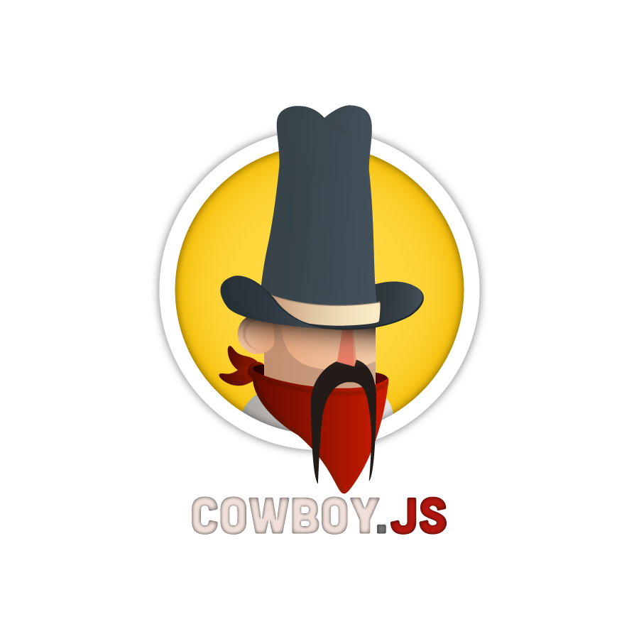

cowboy.js
=========

JS components built on top of [Mootools](http://mootools.net/) to make [GestionAIR](http://www.gestionair.com/) (or your own web projects) faster and efficient to use.

## Components

- **LogBar** : displays a status bar in the bottom of the screen
- **Toggles** : toggles visibility of an element
- **Select Load Data** : auto loader data into a select element (usefull with an Ajax Transaction with data coming from database) 
- **Auto-completion** : auto-complete while you are writing in a select element (suggestions coming from Javascript or an AJAX transaction)
- **Slideshow** : customizable slideshow for pictures
- **Form Ajax** : handler for AJAX forms
- **Modal** : create a modal
- **Input File** : replace the default input file by a more custonizable and cross browser element

## License

cowboy.js is released under the [MIT License](COPYING).

